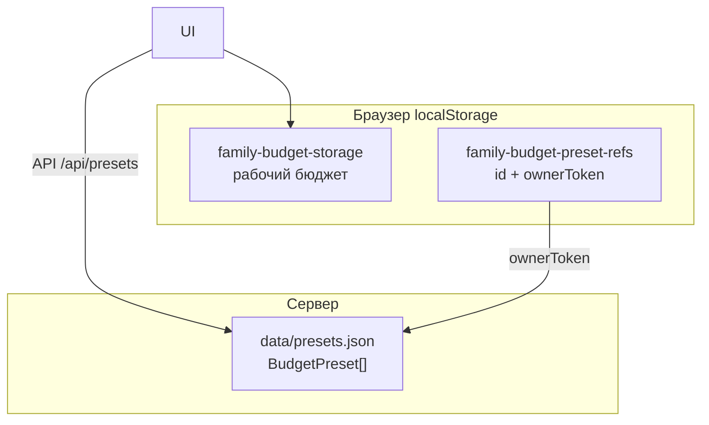
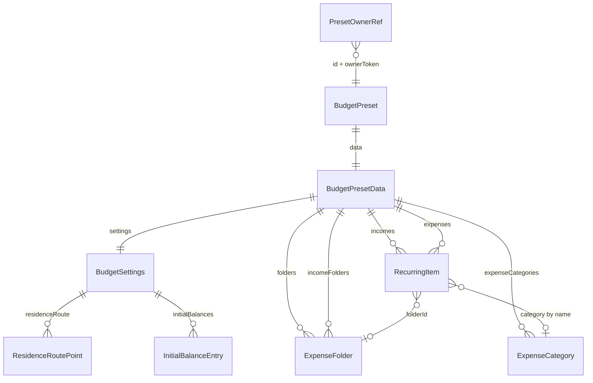

# Схема хранения данных

Приложение не использует SQL-СУБД. Данные лежат в JSON-файлах на сервере и в `localStorage` браузера. Типы — в `src/types/`.

## Обзор хранилищ

| Хранилище | Где | Ключ / путь | Содержимое |
|-----------|-----|-------------|------------|
| Пресеты (сервер) | файл | `data/presets.json` | массив `BudgetPreset[]` |
| Сид пресетов | файл | `data/presets.seed.json` | копия для первичной инициализации |
| Рабочий бюджет | `localStorage` | `family-budget-storage` | Zustand persist: настройки, доходы, расходы, папки, категории |
| Ссылки на свои пресеты | `localStorage` | `family-budget-preset-refs` | `PresetOwnerRef[]` |
| UI сайдбара | `localStorage` | ключ сворачивания меню | `'0'` / `'1'` |

Курсы валют в памяти не персистятся (`exchangeRateStore`).

---

## 1. Сервер: `data/presets.json`

Файл — JSON-массив пресетов. Код: `server/presetsStore.ts`. Путь можно переопределить через `PRESETS_FILE`.

Если файла нет, копируется `presets.seed.json`, иначе создаётся `[]`.

### `BudgetPreset`

| Поле | Тип | Описание |
|------|-----|----------|
| `id` | `string` (UUID) | Идентификатор |
| `name` | `string` | Название |
| `description` | `string` | Описание |
| `isPrivate` | `boolean` | Приватный — не в публичном списке |
| `ownerToken` | `string` (UUID) | Секрет владельца для update/delete |
| `createdAt` | ISO datetime | Создание |
| `updatedAt` | ISO datetime | Последнее изменение |
| `data` | `BudgetPresetData` | Снимок бюджета |

### `BudgetPresetData` (поле `data`)

| Поле | Тип | Описание |
|------|-----|----------|
| `settings` | `BudgetSettings` | Настройки расчёта |
| `incomes` | `RecurringItem[]` | Доходы |
| `expenses` | `RecurringItem[]` | Расходы (в т.ч. разовые и кредиты) |
| `folders?` | `ExpenseFolder[]` | Папки расходов |
| `incomeFolders?` | `ExpenseFolder[]` | Папки доходов |
| `expenseCategories?` | `ExpenseCategory[]` | Пользовательские категории расходов |
| `oneTimeExpenses` | `OneTimeExpense[]` | **deprecated** — пустой массив; разовые в `expenses` с `frequency: "once"` |
| `loans?` | массив | **deprecated** — кредиты в `expenses` с `expenseKind: "loan"` |

Публичный API отдаёт урезанный `BudgetPresetSummary` (метаданные + счётчики, без полного `data`).

---

## 2. Браузер: рабочий бюджет (`family-budget-storage`)

Zustand persist (`src/store/budgetStore.ts`). Сохраняется:

| Поле | Тип |
|------|-----|
| `settings` | `BudgetSettings` |
| `incomes` | `RecurringItem[]` |
| `expenses` | `RecurringItem[]` |
| `folders` | `ExpenseFolder[]` |
| `incomeFolders` | `ExpenseFolder[]` |
| `expenseCategories` | `ExpenseCategory[]` |
| `oneTimeExpenses` | всегда `[]` |
| `activePreset` | `{ id, name, ownerToken? } \| null` |

`presetBaseline` (для «несохранённых изменений») в persist не входит.

---

## 3. Вложенные сущности

### `BudgetSettings`

| Поле | Тип | Описание |
|------|-----|----------|
| `baseCurrency` | `string` | Базовая валюта отчёта |
| `countryCode` | `string` | Legacy: страна проживания |
| `taxRegimeId` | `string` | Legacy: налоговый режим |
| `familySize` | `number` | Размер семьи |
| `dependents` | `number` | Иждивенцы |
| `countryDeductions?` | `{ TH?: ThailandDeductionSettings }` | Вычеты по странам |
| `relocationDate?` | ISO date | Дата переезда (legacy) |
| `relocationProgramId?` | `string` | Программа переезда |
| `relocationMode?` | `remote_employment` \| `sole_proprietorship` | Способ переезда |
| `employmentCountryCode?` | `string` | **deprecated** — страна зарплаты в доходах |
| `residenceRoute?` | `ResidenceRoutePoint[]` | Маршрут проживания |
| `horizonMonths` | `number` | Горизонт планирования, мес. |
| `initialBalances?` | `InitialBalanceEntry[]` | Начальные остатки по валютам |
| `initialBalance` | `number` | **deprecated** |
| `initialBalanceCurrency` | `string` | **deprecated** |
| `initialBalanceDate` | ISO date | Дата начального остатка |
| `parkBalanceOnSavingsAccount?` | `boolean` | Накопительный счёт |
| `savingsAnnualRate?` | `number` | Ставка %, legacy |
| `savingsAccountCurrency?` | `string` | Валюта накопительного счёта |
| `currencyConversionFeePercent?` | `number` | Комиссия за конвертацию, % к курсу ЦБ |

### `ResidenceRoutePoint`

| Поле | Тип | Описание |
|------|-----|----------|
| `id` | `string` | ID точки |
| `countryCode` | `string` | Страна |
| `taxRegimeId` | `string` | Налоговый режим |
| `startDate` / `endDate` | ISO date | Период проживания |
| `regimeParams?` | `ThailandDeductionSettings` | Параметры режима (вычеты и т.п.) |

### `InitialBalanceEntry`

| Поле | Тип | Описание |
|------|-----|----------|
| `id` | `string` | ID строки |
| `amount` | `number` | Сумма |
| `currency` | `string` | Валюта (могут повторяться) |
| `comment?` | `string` | Комментарий |
| `annualRate?` | `number` | Годовая ставка накопительного счёта для этой валюты, % |

### `RecurringItem` (доходы и расходы)

| Поле | Тип | Описание |
|------|-----|----------|
| `id` | `string` | ID |
| `name` | `string` | Название |
| `amount` | `number` | Сумма (для кредита — может дублировать платёж) |
| `currency` | `string` | Валюта |
| `frequency` | `monthly` \| `yearly` \| `weekly` \| `once` | Периодичность |
| `category?` | `string` | Имя категории |
| `categoryId?` | `string` | Служебный id (`salary` и т.п.) |
| `lifecycle?` | `destination` \| `origin` \| `any` | Привязка к этапу переезда |
| `salaryCountryCode?` | `string` | Страна зарплаты |
| `includeInResidenceTax?` | `boolean` | Учитывать в налогах страны проживания |
| `foreignTaxCredit?` | `boolean` | Зачёт иностранного НДФЛ |
| `payments?` | `IncomePayment[]` | Разбивка выплат зарплаты |
| `startDate` | ISO date | Начало |
| `endDate?` | ISO date | Окончание |
| `expenseKind?` | `regular` \| `loan` | Вид расхода |
| `principal?` / `termMonths?` / `annualRate?` | `number` | Параметры кредита |
| `folderId?` | `string` | Папка |
| `expenseCountryScope?` | `employment` \| `residence` \| `other` | Страна расхода |
| `expenseCountryCode?` | `string` | **deprecated** |

`IncomePayment`: `{ label, amount, dayOfMonth? }`.

### `ExpenseFolder`

| Поле | Тип | Описание |
|------|-----|----------|
| `id` | `string` | ID |
| `name` | `string` | Название |
| `sortOrder?` | `number` | Порядок |
| `excluded?` | `boolean` | Исключить из расчётов (папки расходов) |

### `ExpenseCategory`

| Поле | Тип | Описание |
|------|-----|----------|
| `id` | `string` | ID |
| `name` | `string` | Название (помимо встроенных) |
| `sortOrder?` | `number` | Порядок |

Встроенные категории (`Жильё`, `Еда`, …) в JSON не хранятся — заданы в коде (`src/config/expenseCategories.ts`).

### `ThailandDeductionSettings`

Вычеты PIT Таиланда: `parentAllowances`, `lifeInsurance`, `healthInsurance`, `mortgageInterest`, `providentFund`, `rmfContribution`, `socialSecurityPaid` (числа, суммы в THB где применимо).

### `OneTimeExpense` (legacy)

`{ id, name, amount, currency, date, category?, expenseCountryScope? }` — при загрузке мигрирует в `expenses` с `frequency: "once"`.

---

## 4. Браузер: ссылки на пресеты (`family-budget-preset-refs`)

Массив `PresetOwnerRef[]`:

| Поле | Тип | Описание |
|------|-----|----------|
| `id` | `string` | ID пресета на сервере |
| `ownerToken` | `string` | Секрет владельца |
| `name` | `string` | Локальное имя для UI |

Без `ownerToken` приватный пресет и обновление недоступны.

---

## 5. Связи

- Расход/доход ссылается на папку по `folderId`.
- Категория расхода — строковое `category` (имя); пользовательские имена живут в `expenseCategories`.
- Рабочий бюджет и пресет — одна и та же форма `BudgetPresetData` (экспорт/импорт через `exportSnapshot` / `loadFromPreset`). Настройки отдельно не сохраняются — только в составе набора (пресета).

---

## 6. Что не хранится

- Результаты прогноза (`MonthlySnapshot` / `DailySnapshot`) — считаются на лету.
- Курсы ЦБ — только в памяти сессии.
- Встроенные списки категорий и валют — константы в коде.
