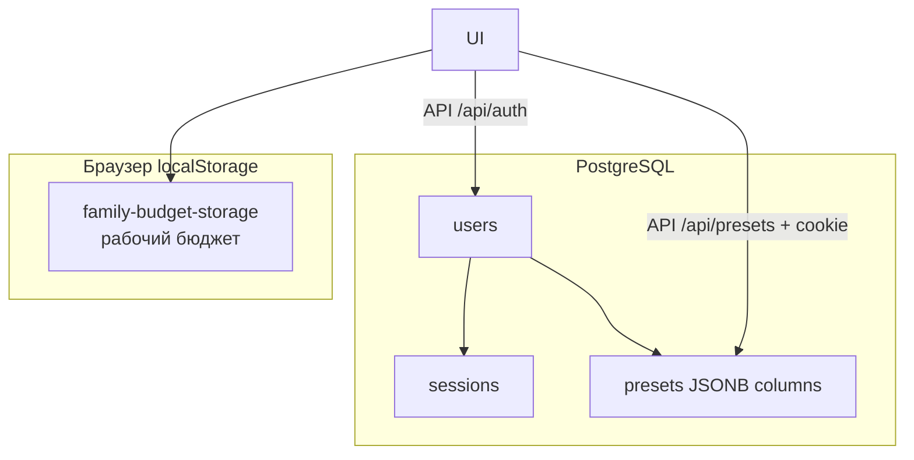
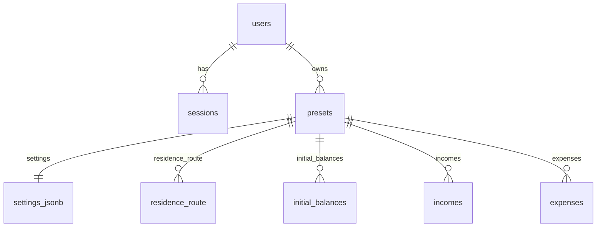

# Схема хранения данных

Рабочий бюджет живёт в `localStorage` браузера. **Пресеты и пользователи** — в **PostgreSQL**. Типы — в `src/types/`.

## Обзор хранилищ

| Хранилище | Где | Ключ / путь | Содержимое |
|-----------|-----|-------------|------------|
| Пресеты, пользователи, сессии | PostgreSQL | `DATABASE_URL` | таблицы `users`, `sessions`, `presets` |
| Сид пресетов (файл) | `data/presets.seed.json` | импорт через `npm run db:seed` | публичные наборы |
| Рабочий бюджет | `localStorage` | `family-budget-storage` | Zustand persist: настройки, доходы, расходы, папки, категории |
| UI сайдбара | `localStorage` | ключ сворачивания меню | `'0'` / `'1'` |

Курсы валют в памяти не персистятся (`exchangeRateStore`).

---

## 1. PostgreSQL

Подключение: переменная `DATABASE_URL` (см. `.env.example`). Локально: `docker compose up -d`, затем `npm run db:migrate` и `npm run db:seed`.

### `users`

| Поле | Тип | Описание |
|------|-----|----------|
| `id` | UUID | PK |
| `email` | TEXT UNIQUE | Email (нижний регистр) |
| `password_hash` | TEXT | scrypt-хэш пароля |
| `created_at` | TIMESTAMPTZ | Создание |

### `sessions`

| Поле | Тип | Описание |
|------|-----|----------|
| `id` | UUID | PK |
| `user_id` | UUID FK → users | Владелец сессии |
| `token_hash` | TEXT UNIQUE | SHA-256 токена из cookie `session` |
| `expires_at` | TIMESTAMPTZ | Срок действия |

### `presets`

Метаданные + **отдельные JSONB-колонки** (не один blob `data`):

| Поле | Тип | Описание |
|------|-----|----------|
| `id` | UUID | PK |
| `user_id` | UUID FK → users | Владелец |
| `name` / `description` | TEXT | Название и описание |
| `is_private` | BOOLEAN | Приватный — не в публичном списке |
| `settings` | JSONB | `BudgetSettings` **без** `residenceRoute` / `initialBalances` |
| `residence_route` | JSONB | `ResidenceRoutePoint[]` |
| `initial_balances` | JSONB | `InitialBalanceEntry[]` |
| `incomes` | JSONB | `RecurringItem[]` |
| `expenses` | JSONB | `RecurringItem[]` |
| `folders` | JSONB | `ExpenseFolder[]` |
| `income_folders` | JSONB | `ExpenseFolder[]` |
| `expense_categories` | JSONB | `ExpenseCategory[]` |
| `created_at` / `updated_at` | TIMESTAMPTZ | Метки времени |

На границе API колонки собираются в клиентский `BudgetPreset.data` (`server/presetPayload.ts`).

Публичный список: `is_private = false`. «Мои»: `user_id` текущей сессии. Приватный чужой пресет — 404.

Авторизация: `POST /api/auth/register|login|logout`, `GET /api/auth/me`. Cookie `session` (HttpOnly).

---

## 2. Браузер: рабочий бюджет (`family-budget-storage`)

Zustand persist (`src/store/budgetStore.ts`). Сохраняется:

| Поле | Тип |
|------|-----|
| `settings` | `BudgetSettings` |
| `incomes` | `RecurringItem[]` |
| `expenses` | `RecurringItem[]` |
| `folders` | `ExpenseFolder[]` |
| `incomeFolders` | `ExpenseFolder[]` |
| `expenseCategories` | `ExpenseCategory[]` |
| `oneTimeExpenses` | всегда `[]` |
| `activePreset` | `{ id, name, ownerId? } \| null` |

`presetBaseline` (для «несохранённых изменений») в persist не входит.

---

## 3. Вложенные сущности

### `BudgetSettings`

| Поле | Тип | Описание |
|------|-----|----------|
| `baseCurrency` | `string` | Базовая валюта отчёта |
| `countryCode` | `string` | Legacy: страна проживания |
| `taxRegimeId` | `string` | Legacy: налоговый режим |
| `familySize` | `number` | Размер семьи |
| `dependents` | `number` | Иждивенцы |
| `countryDeductions?` | `{ TH?: ThailandDeductionSettings }` | Вычеты по странам |
| `relocationDate?` | ISO date | Дата переезда (legacy) |
| `relocationProgramId?` | `string` | Программа переезда |
| `relocationMode?` | `remote_employment` \| `sole_proprietorship` | Способ переезда |
| `employmentCountryCode?` | `string` | **deprecated** — страна зарплаты в доходах |
| `residenceRoute?` | `ResidenceRoutePoint[]` | Маршрут проживания (в БД — колонка `residence_route`) |
| `horizonMonths` | `number` | Горизонт планирования, мес. |
| `initialBalances?` | `InitialBalanceEntry[]` | Начальные остатки (в БД — `initial_balances`) |
| `initialBalance` | `number` | **deprecated** |
| `initialBalanceCurrency` | `string` | **deprecated** |
| `initialBalanceDate` | ISO date | Дата начального остатка |
| `parkBalanceOnSavingsAccount?` | `boolean` | Накопительный счёт |
| `savingsAnnualRate?` | `number` | Ставка %, legacy |
| `savingsAccountCurrency?` | `string` | Валюта накопительного счёта |
| `currencyConversionFeePercent?` | `number` | Комиссия за конвертацию, % к курсу ЦБ |

### `ResidenceRoutePoint`

| Поле | Тип | Описание |
|------|-----|----------|
| `id` | `string` | ID точки |
| `countryCode` | `string` | Страна |
| `taxRegimeId` | `string` | Налоговый режим |
| `startDate` / `endDate` | ISO date | Период проживания |
| `regimeParams?` | `ThailandDeductionSettings` | Параметры режима (вычеты и т.п.) |

### `InitialBalanceEntry`

| Поле | Тип | Описание |
|------|-----|----------|
| `id` | `string` | ID строки |
| `amount` | `number` | Сумма |
| `currency` | `string` | Валюта (могут повторяться) |
| `comment?` | `string` | Комментарий |
| `annualRate?` | `number` | Годовая ставка накопительного счёта для этой валюты, % |

### `RecurringItem` (доходы и расходы)

| Поле | Тип | Описание |
|------|-----|----------|
| `id` | `string` | ID |
| `name` | `string` | Название |
| `amount` | `number` | Сумма (для кредита — может дублировать платёж) |
| `currency` | `string` | Валюта |
| `frequency` | `monthly` \| `yearly` \| `weekly` \| `once` | Периодичность |
| `category?` | `string` | Имя категории |
| `categoryId?` | `string` | Служебный id (`salary` и т.п.) |
| `lifecycle?` | `destination` \| `origin` \| `any` | Привязка к этапу переезда |
| `salaryCountryCode?` | `string` | Страна зарплаты |
| `includeInResidenceTax?` | `boolean` | Учитывать в налогах страны проживания |
| `foreignTaxCredit?` | `boolean` | Зачёт иностранного НДФЛ |
| `payments?` | `IncomePayment[]` | Разбивка выплат зарплаты |
| `startDate` | ISO date | Начало |
| `endDate?` | ISO date | Окончание |
| `expenseKind?` | `regular` \| `loan` | Вид расхода |
| `principal?` / `termMonths?` / `annualRate?` | `number` | Параметры кредита |
| `folderId?` | `string` | Папка |
| `expenseCountryScope?` | `employment` \| `residence` \| `other` | Страна расхода |
| `routePointId?` | `string` | Привязка к пункту маршрута |
| `expenseCountryCode?` | `string` | **deprecated** |

`IncomePayment`: `{ label, amount, dayOfMonth? }`.

### `ExpenseFolder` / `ExpenseCategory`

Как раньше: id, name, sortOrder; у папок расходов — `excluded?`.

Встроенные категории в JSON не хранятся — константы в коде.

### `OneTimeExpense` (legacy)

При загрузке мигрирует в `expenses` с `frequency: "once"`.

---

## 4. Связи

Рабочий бюджет и пресет — одна форма `BudgetPresetData` (экспорт/импорт через `exportSnapshot` / `loadFromPreset`).

---

## 5. Что не хранится

- Результаты прогноза (`MonthlySnapshot` / `DailySnapshot`) — считаются на лету.
- Курсы ЦБ — только в памяти сессии.
- Встроенные списки категорий и валют — константы в коде.
