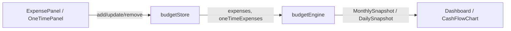

# Архитектура калькулятора расходов

Документ описывает, как в приложении семейного бюджета устроены ввод расходов, их хранение и расчёт в денежном потоке (месячном и дневном прогнозе).

## Обзор

Калькулятор расходов — часть общего **budget engine** (`src/engine/budgetEngine.ts`). Он не считает налоги с расходов; расходы вычитаются из **чистого дохода** после налогов и формируют поля `recurringExpenses` и `oneTimeExpenses` в снимках прогноза.



## Модель данных

### Регулярные расходы — `RecurringItem`

Тип общий с доходами (`src/types/budget.ts`). Для расходов используются поля:

| Поле | Назначение |
|------|------------|
| `name`, `amount`, `currency` | Название и сумма в исходной валюте |
| `frequency` | `monthly`, `yearly`, `weekly`, `once` |
| `category` | Категория (Жильё, Еда, …) |
| `startDate`, `endDate?` | Период действия статьи |

Поля, специфичные для доходов (`payments`, `salaryCountryCode`, `includeInResidenceTax` и т.д.), в расходах не используются.

### Разовые расходы — `OneTimeExpense`

Отдельная сущность: одна сумма на конкретную дату (`date`), без периодичности.

### Настройки, влияющие на расчёт

Из `BudgetSettings`:

- **`baseCurrency`** — все суммы в прогнозе приводятся к этой валюте через `convertCurrency`.
- **`horizonMonths`** — горизонт прогноза (месяцы / дни).
- **`initialBalance`**, **`initialBalanceDate`** — стартовый баланс и дата начала прогноза.
- **`countryCode`**, **`familySize`** — используются в UI для подстановки типового бюджета на «Еду», не участвуют напрямую в engine.

## Хранение состояния

`src/store/budgetStore.ts` (Zustand + persist в `localStorage`):

- `expenses: RecurringItem[]` — регулярные траты
- `oneTimeExpenses: OneTimeExpense[]` — разовые траты
- CRUD: `addExpense`, `updateExpense`, `removeExpense`, `addOneTimeExpense`, …
- Экспорт/импорт через пресеты: `exportSnapshot` / `loadFromPreset` включают оба массива

Изменения в store автоматически пересчитывают дашборд (React `useMemo` в `Dashboard.tsx`).

## Слой UI

### `ExpensePanel` (`src/components/expenses/ExpensePanel.tsx`)

- Форма с валидацией `recurringItemSchema` (`src/lib/validation.ts`)
- Категории: Жильё, Еда, Транспорт, …
- Периодичность: monthly / yearly / weekly (разовая `once` в форме расходов скрыта)
- При выборе категории **«Еда»** подставляются типовые сумма и валюта из `foodBudget.ts`
- Список расходов с конвертацией в базовую валюту для отображения

### `OneTimePanel` (`src/components/onetime/OneTimePanel.tsx`)

- Форма `oneTimeExpenseSchema`: название, сумма, валюта, дата, категория
- Категории переезда: Депозит, Мебель, Авто и т.д.

### Конфигурация «Еды» (`src/config/foodBudget.ts`)

- Константа `FOOD_EXPENSE_CATEGORY = 'Еда'`
- Таблица типовых месячных бюджетов на человека по странам (`FOOD_BUDGET_PER_PERSON`)
- `getTypicalFoodBudget(countryCode, familySize)` — с нелинейным масштабом семьи (`familyFoodScale`)
- `getCountryLocalCurrency` — валюта страны для подстановки в форму

Engine определяет «еду» по **точному совпадению** `category === FOOD_EXPENSE_CATEGORY`, а не по id.

## Ядро расчёта (`budgetEngine.ts`)

### Общие правила

1. **Активность по периоду** — `isActiveInMonth` / `isActiveOnDay` учитывают `startDate`, `endDate` и для `once` — только месяц/день события.
2. **Конвертация** — `toBaseCurrency(amount, currency, baseCurrency)` для каждой статьи.
3. **Плановый день платежа** — для `monthly`/`yearly` день берётся из `startDate` (`scheduledDayMatches`, `yearlyDayMatches`); для `weekly` — каждые 7 дней от `startDate`.

### Регулярные расходы по месяцам

`sumRecurringForMonth(expenses, monthKey, baseCurrency)`:

- Фильтрует активные в месяце статьи
- Для каждой вызывает `recurringAmountForMonth`:
  - **`once`** — полная `amount` (если месяц совпадает)
  - **«Еда» + monthly** — `foodMonthlyAmount(amount, monthKey)` = `(amount / 30) × daysInMonth`
  - **остальное** — `toMonthlyAmount` (weekly × 52/12, yearly / 12, monthly как есть)

### Регулярные расходы по дням

`expenseForDay(expenses, dateStr, baseCurrency)`:

- **«Еда» + monthly** — каждый активный день списывается `foodDailyAmount(amount)` = `amount / 30`
- **monthly** — сумма в день, совпадающий с днём из `startDate`
- **weekly** — сумма каждые 7 дней от `startDate`
- **yearly** — сумма в годовщину даты начала
- **once** — сумма только в `startDate`

Сумма дневных «еды» за месяц согласована с месячной формулой (тесты в `budgetEngine.test.ts`).

### Разовые расходы

- **По месяцу:** `sumOneTimeForMonth` — все записи с `date` в этом `YYYY-MM`
- **По дню:** `sumOneTimeForDay` — точное совпадение `date`

### Формула баланса

В **месячном** прогнозе (`calculateBudgetProjection`):

```
balance = netIncome - recurringExpenses - oneTimeExpenses
cumulativeBalance += balance
```

В **дневном** (`calculateDailyBudgetProjection`) — та же логика на уровне дня; налоги считаются отдельно (пропорционально или по расписанию), расходы к налогам не привязаны.

Публичные вспомогательные функции для тестов и конфигурации:

- `foodMonthlyAmount`, `foodDailyAmount`, `isFoodExpense`
- `generateMonthKeys`, `generateDayKeys`, `getProjectionStartDate`, `getInitialBalanceInBase`

## Связь с дашбордом

`Dashboard.tsx`:

```ts
calculateBudgetProjection(incomes, expenses, oneTimeExpenses, settings)
calculateDailyBudgetProjection(incomes, expenses, oneTimeExpenses, settings)
```

Результаты:

| Компонент | Использование |
|-----------|----------------|
| `SummaryCards` | Агрегаты по месяцам и дням |
| `CashFlowChart` | **Дневной** `cumulativeBalance` и потоки |
| `MonthlyTable` | Помесячная таблица с `recurringExpenses`, `oneTimeExpenses` |
| `findCashGapDays` | Дни с отрицательным `cumulativeBalance` |

Пересчёт зависит также от `useExchangeRateStore` (дата курсов ЦБ), т.к. конвертация валют в engine использует актуальные курсы.

## Особый случай: категория «Еда»

| Режим | Поведение |
|-------|-----------|
| UI | Типовой бюджет по стране и размеру семьи; пользователь может изменить сумму |
| Месячный прогноз | Не фиксированные 300 €/мес, а **300/30 × число дней** (январь ≠ февраль) |
| Дневной прогноз | Равномерное начисление **amount/30** каждый день |

Другие категории с `frequency: monthly` списываются **одним платежом** в день месяца из `startDate`, а не равномерно по дням.

## Тестирование

`src/engine/budgetEngine.test.ts`:

- Снимки с налогами и разовыми расходами
- Формулы `foodMonthlyAmount` / `foodDailyAmount`
- Согласованность месячного и д daily прогноза для «Еды»

`src/config/foodBudget.test.ts` — типовые бюджеты и масштаб семьи.

## Расширение системы

При добавлении новых правил расчёта:

1. Расширить тип или категорию в `types/budget.ts` / конфиге (как `foodBudget.ts`)
2. Добавить ветку в `recurringAmountForMonth` и `expenseForDay` (симметрично для месяца и дня)
3. Обновить UI при необходимости (`ExpensePanel`)
4. Покрыть сценарий в `budgetEngine.test.ts`

Налоговый модуль (`src/tax/*`) с расходами **не связан**; двойное налогообложение и IRPF относятся только к доходам.

## Карта файлов

| Файл | Роль |
|------|------|
| `src/types/budget.ts` | Типы `RecurringItem`, `OneTimeExpense`, снимки |
| `src/store/budgetStore.ts` | Persist-состояние расходов |
| `src/config/foodBudget.ts` | Типовые бюджеты и категория «Еда» |
| `src/engine/budgetEngine.ts` | Расчёт recurring/one-time в прогнозе |
| `src/components/expenses/ExpensePanel.tsx` | UI регулярных расходов |
| `src/components/onetime/OneTimePanel.tsx` | UI разовых расходов |
| `src/components/dashboard/Dashboard.tsx` | Оркестрация прогноза |
| `src/lib/currency.ts` | Конвертация в базовую валюту |
| `src/lib/validation.ts` | Zod-схемы форм |
